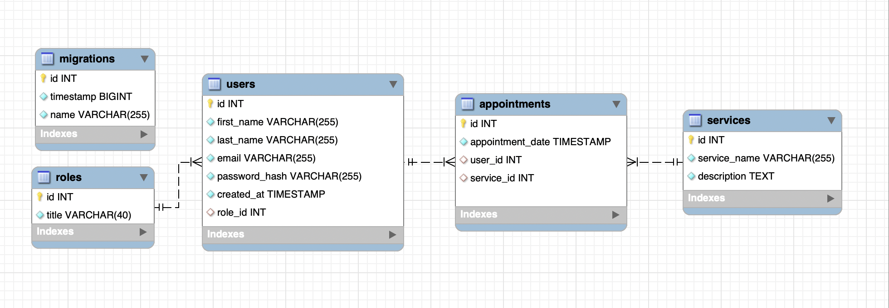

# Appointment Manager Backend

## Tatto Shop


Thank you very much for your interest in my project. This is my the fourth project whit Geekshubs Academyof of the Full Stack Development Bootcamp.

<div>

[![GITHUB]][github-url][![DOCKER]][docker-url][![MYSQL]][MYSQL-url][![Node][Node.JS]][Node.JS-url][![Express][Express.js]][Express.js-url] <a href="https://www.typescriptlang.org/"></a>[![js]][js-url][![JWT]][JWT-url]

<!-- # RSS

[![LINKEDIN]][linkedin-url] -->

[JWT]: https://img.shields.io/badge/JWT-black?style=for-the-badge&logo=JSON%20web%20tokens
[JWT-url]: https://jwt.io/
[Express.js]: https://img.shields.io/badge/express.js-%23404d59.svg?style=for-the-badge&logo=express&logoColor=%2361DAFB
[Express.js-url]: https://expressjs.com/
[Node.JS]: https://img.shields.io/badge/node.js-026E00?style=for-the-badge&logo=node.js&logoColor=white
[Node.JS-url]: https://nextjs.org/
[MYSQL]: https://img.shields.io/badge/mysql-3E6E93?style=for-the-badge&logo=mysql&logoColor=white
[MYSQL-url]: https://www.mysql.com/
[GITHUB]: https://img.shields.io/badge/github-24292F?style=for-the-badge&logo=github&logoColor=white
[github-url]: https://www.github.com/
[GIT]: https://img.shields.io/badge/git-F54D27?style=for-the-badge&logo=git&logoColor=white
[git-url]: https://git-scm.com/
[LINKEDIN]: https://img.shields.io/badge/linkedin-0274B3?style=for-the-badge&logo=linkedin&logoColor=white
[LINKEDIN-url]: https://www.linkedin.com/
[JS]: https://img.shields.io/badge/javascipt-EFD81D?style=for-the-badge&logo=javascript&logoColor=black
[js-url]: https://developer.mozilla.org/es/docs/Web/JavaScript
[DOCKER]: https://img.shields.io/badge/docker-2496ED?style=for-the-badge&logo=docker&logoColor=white
[docker-url]: https://www.docker.com/
[sequelize-url]: https://www.sequelize.org/
[gmail-url]: https://www.gmail.com/

<!-- <a href="https://www.typescriptlang.org/">
    
</a>
<a href="https://www.github.com/">
    
</a> -->
 </div>

<details>
  <summary>Content 📝</summary>
  <ol>
    <li><a href="#objetive-🎯 ">Objetive</a></li>
    <li><a href="#about-a-project-🔎-🔎">About a project</a></li>
    <li><a href="#deploy-🚀">Deploy</a></li>
    <li><a href="#stack">Stack</a></li>
    <li><a href="#view">View</a></li>
    <li><a href="#coding process">Coding process</a></li>
    <li><a href="#project explanation">Project explanation</a></li>
    <li><a href="#contributions">Contributions</a></li>
    <li><a href="#license">Licence</a></li>
    <li><a href="#webgraphy">Webgraphy</a></li>
    <li><a href="#development">Development</a></li>
    <li><a href="#acknowledgments">Acknowledgments</a></li>
    <li><a href="#contact">Contact</a></li>
  </ol>
</details>

## Objetive 🎯

The product department has asked us to develop the backend for the appointment management system for a tattoo studio.

## About a project 🔎

Users can register in the application, log in and access their personal area.
area. Within their area, they will be able to view a list of scheduled appointments for tattoo and piercing services, as well as create new appointments for
tattoo and piercing services, as well as create new appointments for different services offered by the
services offered by the studio,

<!-- ## Deploy 🚀

<div align="center">
    <a href="https://ramer8.github.io/tvInteractiva/"><strong>Url a producción </strong></a>🚀🚀🚀
</div> -->

##Data Base Diagram


## Local install

1. Clone the repoitory
2. `$ npm install`
3. Open the terminal and install docker and execute this command to open a container
   `docker run --name mysql-appointments -p 3309:3306 -e MYSQL_ROOT_PASSWORD=1234 -d mysql`
4. Open Mysql Workbench and set up new dataBase connection

 5. Open a new co 5. Connect owner data base in nuestro repositorio con la base de datos 6. Conectamos nuestro repositorio con la base de datos 7. `$ Ejecutamos las migraciones` 8. `$ Ejecutamos los seeders` 9. `$ npm run dev` 10. ...

<!--
Power on

Channel up function
 -->

## Coding process

35 - 40 hours

## Project explanation

## Contributions

Suggestions and contributions are always welcome.

You can do it in two ways:

1.Opening an issue
2.Create a fork of the repository

- Createa a new branch
  ```
  $ git checkout -b feature/userName-improvement
  ```
- Make a commit with your changes
  ```
  $ git commit -m 'feat: better thing by'
  ```
- Push the branch
  ```
  $ git push origin feature/userName-improvement
  ```
- Open a Pull Request

## License

This project is under license by Ramiro Poblete

## Webgraphy:

To achieve my goal I have collected information from:

- https://developer.mozilla.org/es/

## Development:

```js
const developer = "Ramiro Poblete"

console.log("Developed by: Ramiro Poblete + GeekHub")
```

## Contact

<a href = "mailto:ramirolpoblete@gmail.com"></a>
<a href="https://www.linkedin.com/in/ramiropoblete/" target="_blank"></a>
<a href = "https://github.com/Ramer8"></a>

</p>
